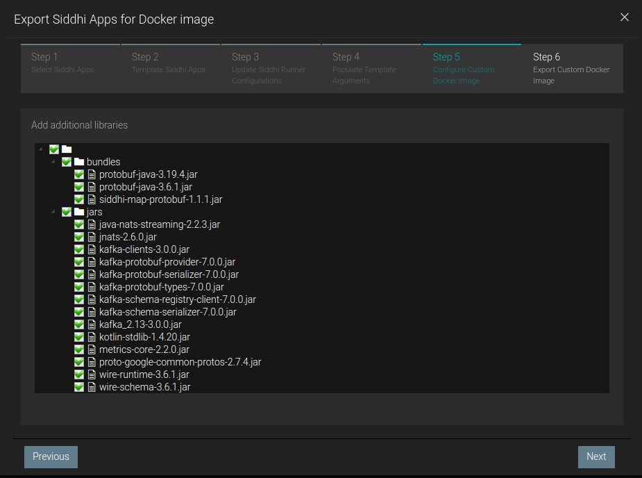

# Kafka Siddhi Tooling
### Siddhi Tooling image with Kafka plugin added

<p>&nbsp;</p>

### How to get jar files
Compiled the [Streaming Integretor Tooling](https://github.com/wso2/streaming-integrator-tooling) project of WSO2(v4.2), the company that makes Siddhi. This project includes Siddhi and has a tool to automatically install plugins on Siddhi.
The plugin can be installed by uploading the files loaded by the plugin installer to pure Siddhi.

<p>&nbsp;</p>

### To get image build
This command should be run in root folder:  
`docker build -t <image_name> -f Dockerfile .`

<p>&nbsp;</p>

### To run image
`docker run --network <network_name> -p 9390:9390 <image_name>`  
The container must be on the same network as kafka.

<p>&nbsp;</p>

### Development of Siddhi project using kafka
When docker build is desired: Docker project can be created automatically in export -> for docker section.  
However, additional files must be selected in Configure Custom Docker Image(Step 4) for the kafka to work.<p>&nbsp;</p>


<p>&nbsp;</p>

### Make sure you have configured Kafka correctly.
```Dockerfile
  broker:
    image: bitnami/kafka
    container_name: kafka
    ports:
      - "9092:9092"
    depends_on:
      - zookeeper
    environment:
      KAFKA_BROKER_ID: 1
      KAFKA_ZOOKEEPER_CONNECT: 'zookeeper:2181'
      KAFKA_ADVERTISED_LISTENERS: PLAINTEXT://kafka:9092
      KAFKA_OFFSETS_TOPIC_REPLICATION_FACTOR: 1
      KAFKA_TRANSACTION_STATE_LOG_MIN_ISR: 1
      KAFKA_TRANSACTION_STATE_LOG_REPLICATION_FACTOR: 1
``` 
* The `KAFKA_ADVERTISED_LISTENERS` parameter specifies the host name that kafka listens to.

<p>&nbsp;</p>

### Example of [Siddhi File](/sample_of_siddhi_file/kafka.siddhi)
```
@App:name('kafka')
@App:description('Consume events from a Kafka Topic and publish to a different Kafka Topic')


@source(type = 'kafka', topic.list = "test", threading.option = "single.thread", group.id = "group", bootstrap.servers = "kafka:9092",
	@map(type = 'json'))
define stream SweetProductionStream (name string, amount double);

@sink(type = 'log',
	@map(type = 'passThrough'))


define stream TotalStream (name string, amount double);

@info(name = 'ExpQuery')
from SweetProductionStream 
select * 
insert into TotalStream;
```
The `bootstrap.servers` parameter must be equal Kafka's `KAFKA_ADVERTISED_LISTENERS` parameter. Addresses of more than one server can be given as a list.  
The `topic.list` parameter must be equal to the list of topic names to be listened to.